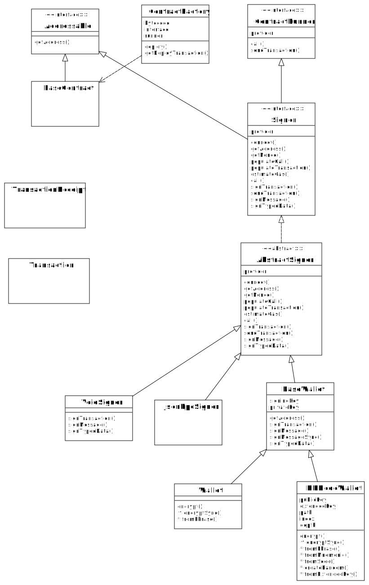
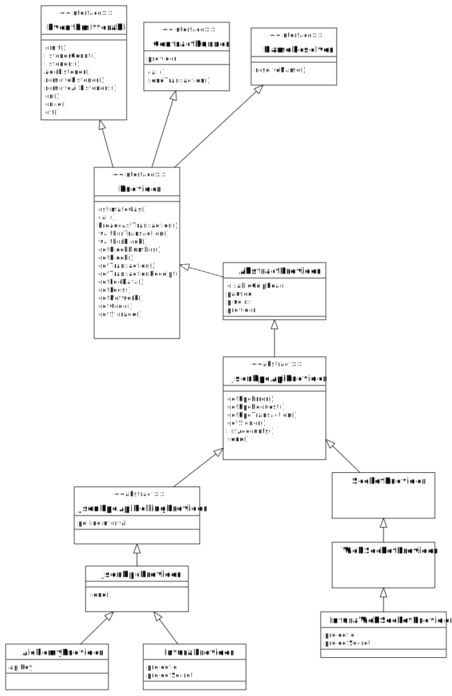

// cspell:word sectnums imagesdir autowidth hyperledger besu kroki plantuml pygments highlightjs
// cspell:ignore

= Ethers v6
:toc:
:sectnums:
:imagesdir: ./
:kroki-fetch-diagram:
:source-highlighter: highlightjs

* Contract and Signer

* Provider

