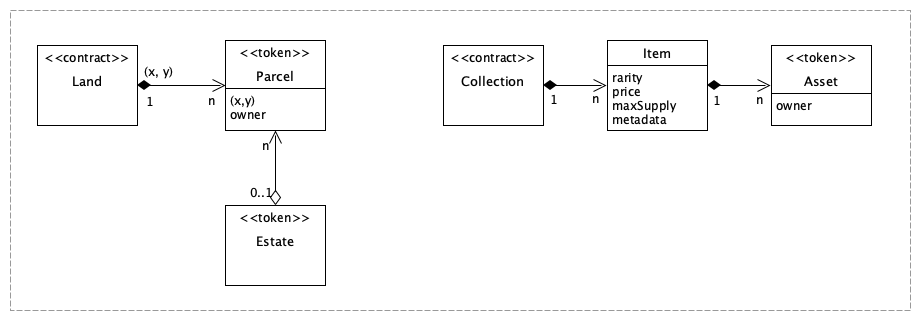

### Decentraland Contracts

#### Concepts

#### Land Contracts

#### Wearable Collection Contracts

* Who is the `beneficiary` of an `Item` ?

#### Resources

* Contract Sources
    | Concept | Sources | Remarks |
    | ------- | ------- | ------- |
    | Land    | https://github.com/decentraland/land | Land, Parcel, Estate |
    | Marketplace | https://github.com/decentraland/marketplace-contracts |   |
    | Collection | https://github.com/decentraland/wearables-contracts | Wearable, Item, Token |

* Contracts Addresses
    | Contract | Address | Remarks |
    | -------- | ------- | ------- |
    | LANDProxy | [`0xf87e31492faf9a91b02ee0deaad50d51d56d5d4d`](https://etherscan.io/address/0xf87e31492faf9a91b02ee0deaad50d51d56d5d4d) |   |
    | LANDRegistry | [`0xa57e126b341b18c262ad25b86bb4f65b5e2ade45`](https://etherscan.io/address/0xa57e126b341b18c262ad25b86bb4f65b5e2ade45) |   | 
    | EstateProxy | [`0x959e104e1a4db6317fa58f8295f586e1a978c297`](https://etherscan.io/address/0x959e104e1a4db6317fa58f8295f586e1a978c297) |   |
    | EstateRegistry | [`0x1784ef41af86e97f8d28afe95b573a24aeda966e`](https://etherscan.io/address/0x1784ef41af86e97f8d28afe95b573a24aeda966e) |   |
    | MarketplaceProxy | [`0x8e5660b4ab70168b5a6feea0e0315cb49c8cd539`](https://etherscan.io/address/0x8e5660b4ab70168b5a6feea0e0315cb49c8cd539) |   |
    | Marketplace | [`0x19a8ed4860007a66805782ed7e0bed4e44fc6717`](https://etherscan.io/address/0x19a8ed4860007a66805782ed7e0bed4e44fc6717) |   |
    | MANAToken | [`0x0f5d2fb29fb7d3cfee444a200298f468908cc942`](https://etherscan.io/address/0x0f5d2fb29fb7d3cfee444a200298f468908cc942)  |   |

* [Decentraland documentation](https://docs.decentraland.org/)
